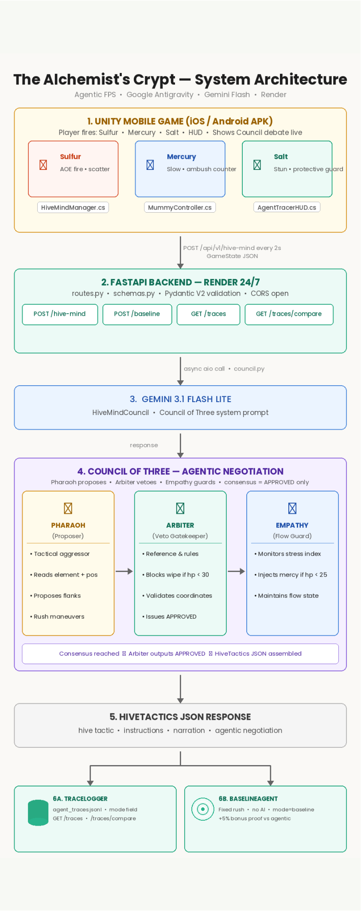

<div align="center">


<sub>**GOOGLE ANTIGRAVITY HACKATHON — AGENTIC GAME QUEST, CHALLENGE 4**</sub>

# 🏺 The Alchemist's Crypt

### *A tactical Agentic FPS where a living AI controls the tomb*

[](https://github.com/google-antigravity)
[](https://unity.com)
[](https://deepmind.google/technologies/gemini/)
[](https://fastapi.tiangolo.com)
[](https://python.org)
[](https://learn.microsoft.com/en-us/dotnet/csharp/)
[](https://docs.pydantic.dev)
[](LICENSE)

*"The curse does not breathe, yet it feels your pulse."*

**A tactical FPS where a Council of Three AI agents controls an ancient Egyptian tomb — and adapts to destroy you in real time.**

[🌐 Live API](https://alchemists-crypt-backend.onrender.com) · [📑 Swagger Docs](https://alchemists-crypt-backend.onrender.com/docs) · [🎮 Unity Repo](https://github.com/waybig125/Hackathon---Pharoah-Game) · [⚙️ Backend Repo](https://github.com/KAreebaSherwani/alchemists-crypt-ai)

</div>

---

## 🎯 What Is This?

In this ancient tomb, you are not just fighting monsters — you are fighting a **living, thinking entity**.

A **Council of Three AI agents**, powered by Gemini 3 Flash via Google Antigravity, observes your every move, adapts to your elemental choices, and coordinates mummy guards to suppress your progress. Every decision you make is a data point. Every session is unique. The enemy has **studied you**.

Heavy AI inference is **fully decoupled from the Unity runtime** and shifted to a high-performance cloud backend — the game engine fires a REST call every 2 seconds, the Council negotiates a new tactical consensus, and the result is mapped live onto the enemy NavMesh.

---

## 🏗️ Two-Repo Architecture

This project is split across two repositories — a **Unity game client** and a **FastAPI AI backend** — connected by a live REST bridge:

| Layer | Repo | Stack |
| :--- | :--- | :--- |
| 🎮 **Game Client** | [`waybig125/Hackathon---Pharoah-Game`](https://github.com/waybig125/Hackathon---Pharoah-Game) | Unity 6 · C# · URP · HLSL · ShaderLab |
| ⚙️ **AI Backend** | [`KAreebaSherwani/alchemists-crypt-ai`](https://github.com/KAreebaSherwani/alchemists-crypt-ai) | FastAPI · Gemini 3 Flash · Pydantic V2 · Render |

<div align="center">
  
</div>

---

## ⚔️ Gameplay — The Alchemy System

The player wields an **Alchemical Focus** with three elemental firing modes. Each one teaches the Hive Mind something new:

| Element | Combat Effect | Hive Mind Counter-Response |
| :---: | :--- | :--- |
| 🔥 **Sulfur** | High AOE Fire Damage | Mummies **scatter** and maintain optimal spacing |
| 💧 **Mercury** | Crowd-control slow | Hive Mind routes units into **ambush** lanes |
| 💎 **Salt** | Targeted stun & purification | Mummies form **protective bodyguards** around High-Priests |

> The player is never fighting a static loop. They are fighting an enemy that has **studied them**.

---

## 🧠 The Agentic Core — Council of Three

The Hive Mind is not a single-prompt LLM wrapper. It is a true **multi-agent runtime loop** — three distinct AI personas in constant live negotiation before a single command reaches the battlefield:

```
PHARAOH  (Strategist)  →  Proposes aggressive, scaling tactical bundles based on telemetry
          ↓
ARBITER  (Referee)     →  Evaluates & vetoes unfair plans  [hard rule: no wipeout if health < 30]
          ↓
EMPATHY  (Flow State)  →  Monitors frustration patterns & injects mercy micro-adjustments
          ↓
CONSENSUS AGREEMENT    →  Executed only when Arbiter outputs a verified APPROVED matrix
```

This live negotiation trace is fully serialized and **visible in real-time** via the in-game **Agent Trace HUD** — giving judges complete structural transparency into every decision made.

<details>
<summary><strong>📋 Sample Agentic Negotiation Output</strong></summary>

```json
{
  "hive_tactic": "Suppressive Flank",
  "agentic_negotiation": {
    "pharaoh_proposal": "Full aggressive rush to capitalize on low player health.",
    "arbiter_veto": "VETO: Player health (45) + Sulfur AOE suggests a rush is unfair. Re-calculating.",
    "empathy_note": "Player showing frustration patterns. Suggest 1.5s delay on Unit 1.",
    "final_consensus": "APPROVED: Flank maneuver with delay to maintain Flow State."
  },
  "reasoning_trace": "Pivoting from Rush to Flank. Countering Sulfur via staggered positioning.",
  "arbiter_check": "APPROVED. Intensity: 0.78 (Optimal).",
  "instructions": [
    { "unit_id": 1, "action": "flank_left", "delay_seconds": 1.5 },
    { "unit_id": 2, "action": "suppress_cover", "delay_seconds": 0.0 }
  ],
  "narration": "The fires of sulfur cannot cleanse this ancient curse!"
}
```

</details>

---

## 🎮 Unity Client — Game Features

**Engine:** Unity 6 · Universal Render Pipeline · PSX/Retro-style 3D  
**Platforms:** Mobile (Primary) · Desktop  
**Languages:** C# `74.3%` · ShaderLab `20.1%` · HLSL `3.8%` · Python `0.1%`

| System | Details |
| :--- | :--- |
| 🏜️ **Visual Style** | Egyptian Desert aesthetic · Custom procedural crack shaders · Global Reflection Probe · Reflective floor/terrain |
| 📱 **Mobile HUD** | Full mobile HUD overhaul · Minimap v2 · Joystick input modernization |
| 🔊 **Audio** | Full audio systems · Environmental & combat sound design |
| 🤖 **AI Spawning** | Android AI spawning · Pharaoh FBX rig · Crates/barrels with `isStatic` physics |
| 🌊 **Environment** | Smooth terrain coastline · Azure blue skybox · Sea & coastline polish |
| 🔗 **Backend Link** | REST `POST` every 2 seconds → parses HiveTactics JSON → shifts NavMesh behavior |

### Unity Repo Structure

```
Hackathon---Pharoah-Game/
├── Artifacts/      # Implementation plans, task lists, and research notes
├── Docs/           # Project documentation and guides
├── Phases/         # Detailed phase-by-phase sprint documentation
└── Assets/         # Unity project assets
```

---

## 🔌 API Reference

| Method | Endpoint | Description |
| :---: | :--- | :--- |
| `POST` | `/api/v1/hive-mind` | Accepts live telemetry from Unity, pipes through agent council |
| `POST` | `/api/v1/hive-mind/baseline` | Evaluates identical payload against a hardcoded static rule matrix |
| `GET` | `/api/v1/traces` | Returns the last 10 historical decisions with full negotiation logs |
| `GET` | `/api/v1/traces/compare` | Real-time metrics contrasting agentic output vs static loops |

**Production URL:** `https://alchemists-crypt-backend.onrender.com`  
**Interactive Docs:** `https://alchemists-crypt-backend.onrender.com/docs`

<details>
<summary><strong>📥 Client Payload Schema — <code>POST /api/v1/hive-mind</code></strong></summary>

```json
{
  "gameState": "Chamber_02",
  "session_metadata": {
    "tick_id": 442,
    "last_tactic_success": false,
    "difficulty_scaling": 0.85
  },
  "player": {
    "pos": [12.4, 0.0, 5.2],
    "vel": [2.1, 0.0, -0.5],
    "active_element": "Sulfur",
    "health": 45,
    "is_firing": true
  },
  "mummies": [
    { "id": 1, "pos": [2.0, 0.0, 2.1], "hp": 50,  "state": "Stunned" },
    { "id": 2, "pos": [5.5, 0.0, 8.3], "hp": 100, "state": "Chasing" }
  ]
}
```

</details>

---

## 📊 Baseline Evaluation Metrics

A standalone `BaselineAgent` running a classic un-adapting state chase loop provides a direct comparison against the Hive Mind:

| Metric | Baseline (Static Chase) | Hive Mind (Agentic) |
| :--- | :---: | :---: |
| Tactical Variance | `1` — always `"Standard Rush"` | ✅ **8+ distinct maneuvers** |
| Element Countering | ❌ Blind to weapon modes | ✅ Real-time counter-formations |
| Player Fail-Safe | ❌ Static damage (creates softlocks) | ✅ Arbiter vetoes at health < 30 |
| Frustration Handling | ❌ Flat penalty enforcement | ✅ Empathy injection adjustments |
| Adaptability | Predictable linear tracking | ✅ Dynamic consensus negotiation |

---

## 🛡️ Robustness & Fallback Strategy

- **The Lifeboat Protocol** — If the LLM, network, or edge-case timeout triggers a failure state, the proxy routing transparently returns a `"Standard Patrol"` config to Unity. The game client never hitches, pauses, or drops a frame.
- **Granular Validation** — Every token returned passes through field constraints via **Pydantic V2**. Structural degradation or missing keys are gracefully logged while triggering safe failback systems.

---

## 💰 Operational Economics

| Metric | Value |
| :--- | :--- |
| Per-request cost | `~$0.000075` (Gemini Flash) |
| End-to-end latency | `~800ms – 1.2s` |
| Requests per 10-min session | `~300` |
| Cost per full session | `~$0.022` |
| Concurrent session capacity | Up to **100** (scales via Redis cache layers) |

---

## 🗂️ Data Schemas

```python
from pydantic import BaseModel, Field, ConfigDict
from typing import List

class GameStateSchema(BaseModel):
    model_config = ConfigDict(populate_by_name=True)

    game_state:       str        = Field(..., alias="gameState")
    session_metadata: dict       = Field(..., alias="session_metadata")
    player:           dict
    mummies:          List[dict]
```

---

## ⚙️ Backend Local Setup

```bash
# Clone the backend repo
git clone https://github.com/KAreebaSherwani/alchemists-crypt-ai.git
cd alchemists-crypt-ai

# Create and activate virtual environment
python -m venv .venv
source .venv/bin/activate        # macOS / Linux
# .venv\Scripts\activate         # Windows

# Install dependencies
pip install -r requirements.txt

# Configure environment
echo GEMINI_API_KEY=your_key_here > .env

# Start the server
python main.py
```

Open `http://localhost:8000/docs` to interface with the API manually.

**For the Unity client**, open `Hackathon---Pharoah-Game/` in Unity 6 and point the backend URL in the game settings to your local or production server.

---

## 🧪 Tests

```bash
pytest tests/ -v
```

Expected output: **4 test suites, 10 passing assertions.**

---

## 📁 Backend Repo Structure

```
alchemists-crypt-ai/
├── docs/
│   ├── overview.md
│   └── council_system_prompt.md
├── phases/                         # Phase-by-phase development logs
│   ├── phase1.md
│   ├── phase2.md
│   └── phase3.md
├── src/
│   ├── agents/
│   │   ├── council.py              # HiveMindCouncil execution core
│   │   └── baseline_agent.py       # Baseline comparison controller
│   ├── api/
│   │   └── routes.py               # FastAPI endpoint routing
│   ├── crud/
│   │   └── trace_logger.py         # JSONL telemetry pipeline
│   └── models/
│       └── schemas.py              # Pydantic V2 validation schemas
├── tests/
│   ├── test_hive_mind.py
│   ├── test_phase2.py
│   └── test_phase3.py
├── traces/
│   └── agent_traces.jsonl          # Append-only live tracing log
├── main.py
├── requirements.txt
└── runtime.txt
```

---

## 🔒 Security & Privacy

The engine does not collect, transmit, or parse any personal identification data. All telemetry contains exclusively real-time geometric and numerical variables — vectors, bounding structures, weapon state indices, and entity counts. No user data can be traced back to physical endpoints, ensuring full compliance with international security and game asset evaluation mandates.

---

<div align="center">


*Submission for the [Google Antigravity Hackathon](https://github.com/google-antigravity) — Agentic Game Quest, Challenge 4*

**Contributors: [waybig125](https://github.com/waybig125) · [KAreebaSherwani](https://github.com/KAreebaSherwani)**

</div>
